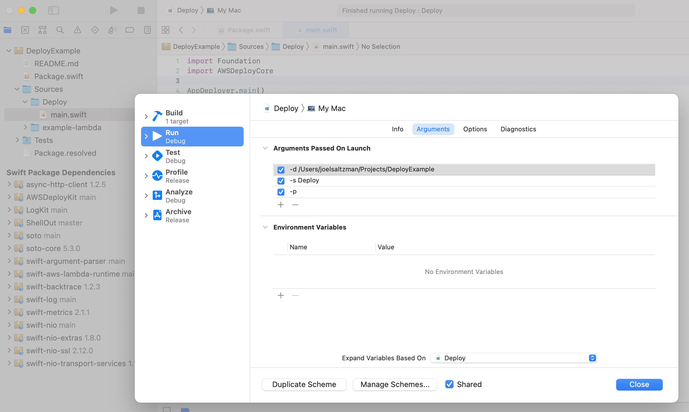

## AWSDeployKit

[](https://swift.org)
[](https://github.com/saltzmanjoelh/AWSDeployKit/actions)
[](https://codecov.io/gh/saltzmanjoelh/AWSDeployKit)

Helps with building Swift packages in Linux and publishing to an AWS Lambda. 

The `aws-deploy` product is simply an executable target for the `AWSDeploy` object. If you plan on [using this from the command line](#using-from-the-command-line), you will simply build the aws-deploy target and copy the product somewhere. However, I prefer to use this in Xcode, more on this [below](#use-this-in-xcode)

## TLDR
```shell
git clone https://github.com/saltzmanjoelh/aws-deploy-kit.git && \
cd aws-deploy-kit && \
swift build && \
swift run aws-deploy -d /path/to/project aws-lambda-function-name
```

## How does it work?

### Pick a path
In it's simpliest form, you execute the `aws-deploy` binary and it will use your current working directory. You can override this and specify which directory with `-d path-to-package` or `--directoryPath path-to-package`. 

### Build
Build one or more executables inside of a Docker container. It will read your Swift package and build the executables of your choosing. If you leave the defaults, it will build all of the executables in the package. You can optionally choose to skip targets, or you can tell it to build only specific targets.

The Docker image `swift:5.3-amazonlinux2` will be used by default. You can override this by adding a Dockerfile to the root of the package's directory. 

The built products will be available at `./build/lambda/$EXECUTABLE/`. You will also find a zip in there which contains everything needed to update AWS Lambda code. The archive will be in the format `$EXECUTABLE_NAME.zip`.

The build command has options available to build, publish and invoke all in one command. Please see the `aws-deploy build --help` for reference.

### Publish
Publish the changes to a Lambda function using a blue green process.

If there is no existing Lambda with a matching function name, this will create it for you. A role will also be created with AWSLambdaBasicExecutionRole access and assigned to the new Lambda.

If the Lambda already exists, it's code will simply be updated.

We test that the Lambda doesn't have any startup errors by using the Invoke API, please check the `aws-deploy invoke --help` for reference. If invoking the function does not abort abnormally, the supplied alias (the default is `development`) will be updated to point to the new version of the Lambda.

The blue/green deployment steps are as follows:
* Create/update the Lambda function code. [CreateFunction](https://docs.aws.amazon.com/lambda/latest/dg/API_CreateFunction.html) / [UpdateFunctionCode](https://docs.aws.amazon.com/lambda/latest/dg/API_UpdateFunctionCode.html)
* Publish the updated code to $LATEST so that a new version number is created. [PublishVersion](https://docs.aws.amazon.com/lambda/latest/dg/API_PublishVersion.html)
* Verify that the function does not have startup errors. [Invoke](https://docs.aws.amazon.com/lambda/latest/dg/API_Invoke.html)
* Point the Lambda's alias (default is `development`)  to the new version. [UpdateAlias](https://docs.aws.amazon.com/lambda/latest/dg/API_UpdateAlias.html)

### Invoke

Invoke your Lambda. This is used in the publishing process to verify that the Lambda is still running properly before the alias is updated. You could also use this when debugging. Please read the `aws-deploy invoke help` for more details.

## Using in Xcode
The goal here is to be able to deploy your Lambda functions from within the project that you are working. You will simply switch your run target to the deployment target and publish a new versions of your Lambda. The steps will basically be duplicating the `aws-deploy` target from `aws-deploy-kit`.

* From your `swift-aws-lambda-runtime` project, create a new target that depends on `AWSDeployCore`. Let's call this `Deploy` for the example.
```swift
.target(
    name: "Deploy",
    dependencies: [
        .product(name: "AWSDeployCore", package: "aws-deploy-kit")
    ]),
```

* You only need 2 lines in the `main.swift` file:
  ```swift
  import AWSDeployCore
  AWSDeploy.main()
  ```
  
* Switch your selected target in Xcode to your new target `Deploy`.
* Press `cmd` + `shift` + `<` to edit the scheme.
* Add the path to your project in the "Arguments Passed On Launch" section `-d /path/to/project/`.
* This is enough to build in Docker. You can optionally pass the `-p` to publish to your Lambda.


Now when you want to deploy, simply pick your new target and run. Logs should appear in the Xcode console. 

You can take a look at the [AWSDeployKitExample](https://github.com/saltzmanjoelh/AWSDeployKitExample) project as well.


## Using from the command line

* Build the `aws-deploy` target.
* Copy to `/usr/local/bin` or similar.
* Run it with the path to your project directory. `aws-deploy -d /path/to/project executable-name -p`.


### TODO
Always check for alias, not just on creation

The input for the Lambdas can vary. Maybe it takes a string value or maybe it takes json string that decodes to a dictionary.
Add a build sub command
Add an invoke subcommand to help debug with.
The default action is to build. We will need an option to specify the json payload. If it begins with "file://", read the file. This option should use the invoke subcommand
It should work similar to building in that you can test all endpoints, skip some, or be specific
Check for a .invoke file to test the lambda with?
You can invoke a local or remote endpoint.
